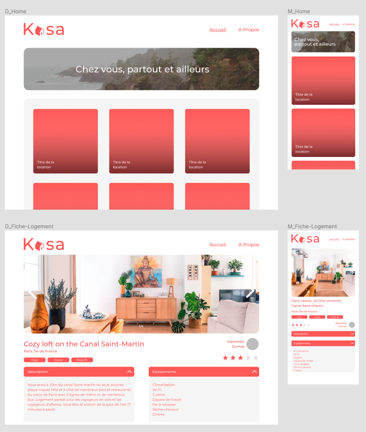
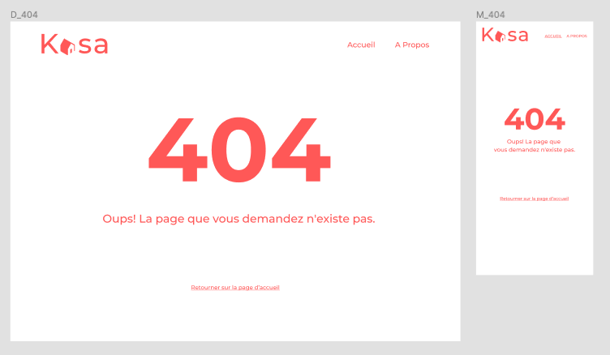
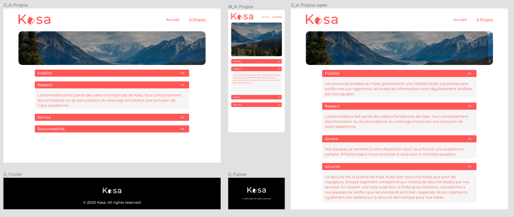

# Project 11 OpenClassrooms - Develop a web application with React and React Router

Develop a new web platform for a company called Kasa, which has been in the business of renting apartments for almost 10 years now.
With more than 500 ads posted every day, Kasa is one of the leaders in apartment rentals in France.

## Logo

## Project goal

- Start the React project and develop the entire application, React components, React Router routes, following the mockups (responsive!).
- Back-end / data: Use the 20 housing listings in the JSON file to build the corresponding Front-end.

## Technical constraints

#### React

It is essential to use these elements of React for quality code:

- Breakdown into re-usable, module-based components.
- One component per file.
- Logical structure of different files.
- Use of props between components.
- Use of state in components if necessary.
- Event management.
- Lists: React allows you to do some really interesting things with lists, by iterating on them, for example with map. You should use them as much as possible.
- It is also recommended, but not required, to use functional components rather than class components.

#### React Router

- Route parameters are handled by React Router in the URL to retrieve information for each housing.
- There is one page per route.
- The 404 page is returned for each non-existent route, or if a value present in the URL is not part of the data entered.
- The router logic is gathered in a single file.

## Functional constraints

- For the photos in the gallery (Gallery component): If the user is at the first image and clicks on "previous image", the gallery displays the last image.
- Conversely, when the displayed image is the last one in the gallery, if the user clicks on "next image", the gallery displays the first image.
- If there is only one image, the "next" and "previous" buttons do not appear.
- The gallery must always remain at the same height as indicated on the mockup. The images will therefore be collapsed and centered in the image field.
- Collapse: By default, collapses are closed when the page is initialized.
- If the Collapse is open, the user's click allows to close it.
- Conversely, if the Collapse is closed, the user can click to open it.

## Mockup

